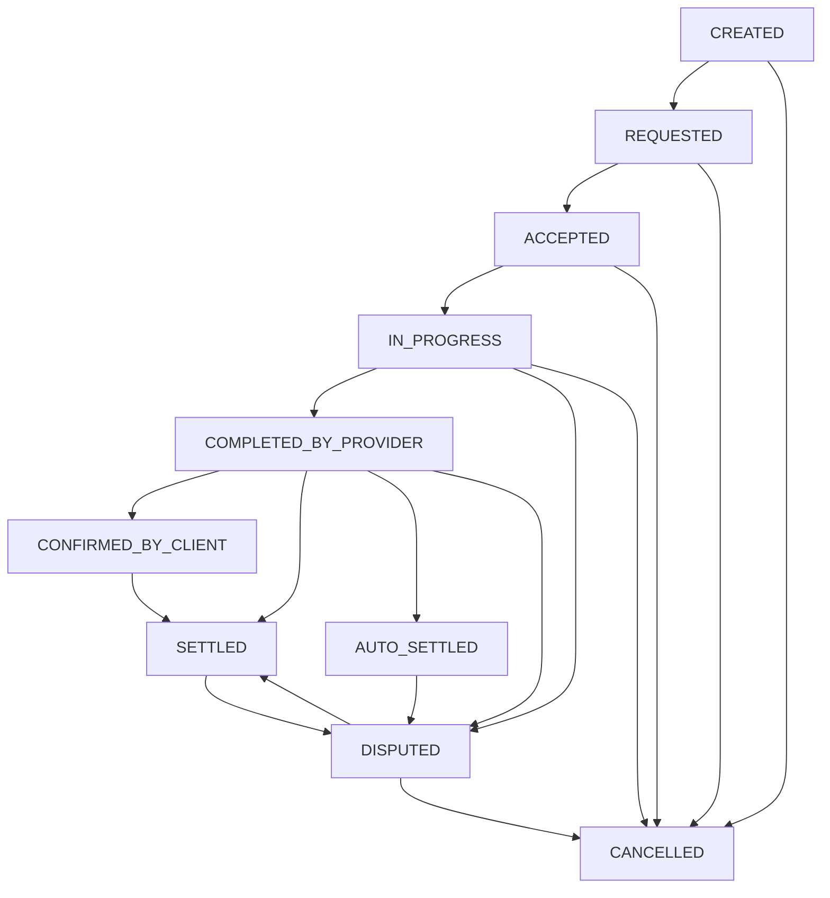

# Fixmate Backend API System

Welcome to the **Fixmate** Backend API codebase. Fixmate is a premium, on-demand marketplace platform connecting **Clients** (customers looking for services) with **Providers** (independent professionals offering category-specific services).

This repository is built using a modern **Node.js, TypeScript, Express, MongoDB (Mongoose), Socket.io, and Redis (BullMQ)** stack, structured following layered Clean Architecture design principles.

---

## 🛠️ Technology Stack & Core Integrations

The system utilizes a modern and robust technical stack to achieve peak performance, reliability, and security:

*   **Runtime & Framework**: [Node.js](https://nodejs.org) (v18+) with [TypeScript](https://www.typescriptlang.org) and [Express.js](https://expressjs.com) for high-performance, strictly typed routing.
*   **Database**: [MongoDB](https://www.mongodb.com) with [Mongoose ODM](https://mongoosejs.com) for data modeling, validations, and transaction processing.
*   **Background Queues**: [BullMQ](https://bullmq.io) backed by [Redis (ioredis)](https://redis.io) for task scheduling, account/booking cleanup, and async event dispatching.
*   **Realtime Communication**: [Socket.io](https://socket.io) for live coordinate tracking, status synchronization, and direct customer-provider chat.
*   **Payment Gateway**: [Paystack](https://paystack.com) for credit card checkouts, cancellation refunds, and provider bank payouts.
*   **Document Generation**: [PDFKit](https://pdfkit.org) for customized, role-based PDF invoice generation.
*   **Security & Auth**: JWT (JSON Web Tokens), Bcryptjs, twilio for SMS-OTP, and express-rate-limit.
*   **Object Storage**: [Cloudinary](https://cloudinary.com) for CDN-optimized media and avatar uploads.
*   **Notifications**: [Firebase Admin SDK](https://firebase.google.com) for Firebase Cloud Messaging (FCM) push notifications.

---

## 📂 Project Directory Structure

```
Fixmate/
├── src/
│   ├── app/
│   │   ├── DB/                  # DB Seeding scripts (e.g. admin accounts)
│   │   ├── builder/             # QueryBuilder for filtering, searching, sorting, and pagination
│   │   ├── middleware/          # JWT Auth, request validation, global error handler, req body processors
│   │   ├── modules/             # Feature-specific modules (Controllers, Services, Models, Routes)
│   │   ├── queues/              # BullMQ queue definitions, worker implementations, and setup
│   │   └── routes/              # Centralized express routing index
│   ├── config/                  # Configuration loaders (.env parsing, redis configuration, uploads config)
│   ├── enum/                    # Global system enums (User roles, booking status, payment status)
│   ├── errors/                  # Custom error classes (e.g. ApiError) and handlers
│   ├── helpers/                 # Utility helpers (Paystack integration, PDF generation, socket helpers, etc.)
│   ├── shared/                  # Common logging (Winston), HTTP loggers (Morgan), email templates, SMS utils
│   ├── utils/                   # General utilities (cryptography, ID generators, Maps APIs)
│   ├── app.ts                   # Express Application setup and middleware pipeline
│   ├── server.ts                # Server entry point (Mongoose connection, server bootstrap, Socket.io hook)
│   └── gm.ts                    # Custom CLI Module Generator script
├── example.env                  # Mock environment configuration variables template
├── tsconfig.json                # TypeScript project configuration rules
└── package.json                 # Node project configuration and dependencies
```

---

## ⚙️ Configuration & Environment Setup

Create a `.env` file at the root of the project by copying `example.env` and filling in the credentials:

```bash
cp example.env .env
```

### Environment Variables Reference

| Variable Name | Description | Example / Default |
| :--- | :--- | :--- |
| `NODE_ENV` | Mode of operation (`development`, `production`) | `development` |
| `IP_ADDRESS` | Server binding IP address | `127.0.0.1` |
| `PORT` | Running port of the Express server | `6005` |
| `DATABASE_URL` | MongoDB connection URI string | `mongodb://localhost:27017/fixmate-db` |
| `BCRYPT_SALT_ROUNDS`| Salt rounds for Bcrypt password hashing | `12` |
| `JWT_SECRET` | Secret key used to sign Access JWT tokens | `your_access_secret` |
| `JWT_EXPIRE_IN` | Validity duration of Access JWT | `1d` |
| `JWT_REFRESH_SECRET`| Secret key used to sign Refresh JWT tokens | `your_refresh_secret` |
| `JWT_REFRESH_EXPIRES_IN`| Validity duration of Refresh JWT | `30d` |
| `EMAIL_FROM` | Sender address for transactional emails | `noreply@fixmate.cloud` |
| `EMAIL_USER` / `EMAIL_PASS`| SMTP Credentials | `smtp_username` / `smtp_password` |
| `EMAIL_PORT` / `EMAIL_HOST`| SMTP Port and Host | `587` / `smtp.mailgun.org` |
| `TWILIO_ACCOUNT_SID`| Twilio Account ID for SMS OTP | `ACxxxxxxxxxxxxxxxxxxxxxxxx` |
| `TWILIO_AUTH_TOKEN` | Twilio Authorization Token | `your_twilio_auth_token` |
| `TWILIO_NUMBER` | Twilio registered phone number | `+1234567890` |
| `CLOUDINARY_CLOUD_NAME`| Cloudinary Storage Space Cloud Name | `your_cloudinary_name` |
| `CLOUDINARY_API_KEY` | Cloudinary API access key | `your_cloudinary_key` |
| `CLOUDINARY_API_SECRET`| Cloudinary API secret | `your_cloudinary_secret` |
| `PAYSTACK_PUBLIC_KEY`| Paystack Public Key for frontend checkouts | `pk_test_xxxxxxxxxx` |
| `PAYSTACK_SECRET_KEY`| Paystack Secret Key for backend operations | `sk_test_xxxxxxxxxx` |
| `REDIS_HOST` / `REDIS_PORT`| Redis server connection variables | `127.0.0.1` / `6379` |
| `FIREBASE_SERVICE_ACCOUNT_BASE64`| Base64 encoded Firebase service account JSON | `eyJ0eXBlIjogInNlcnZpY2VfYWNjb3VudCI...` |

---

## 🚀 Running the Project Locally

### 1. Installation
Install the project dependencies using yarn or npm:
```bash
yarn install
# or
npm install
```

### 2. Run in Development Mode
Starts the application in live-reload mode using `ts-node-dev`:
```bash
yarn dev
# or
npm run dev
```

### 3. Generate a New Module
The system features a code generator `gm.ts` to scaffold modules following established patterns:
```bash
npm run create-module <ModuleName>
# Example: npm run create-module SupportTicket
```
*This command creates `src/app/modules/supportticket/` folder containing Controller, Service, Route, Model, Interface, Validation, Constants templates, and automatically links the route inside [index.ts](file:///d:/Fahim/Projects/Fixmate/src/app/routes/index.ts).*

### 4. Build and Production Run
```bash
yarn build
yarn start
```

*Note: On system bootstrap, the [seedAdmin](file:///d:/Fahim/Projects/Fixmate/src/app/DB/index.ts) routine runs to create the Super Admin account automatically if it does not exist in the database.*

---

## 📈 System Architecture & Core Workflows

### 1. Booking State Machine & Lifecycle

All bookings flow through a state validation layer managed inside [bookingStateMachine.ts](file:///d:/Fahim/Projects/Fixmate/src/app/modules/booking/bookingStateMachine.ts). The diagram below displays valid status transitions:



### 2. Financial Splits & Calculations
When a booking is settled, the following pricing calculation occurs within [payment.service.ts](file:///d:/Fahim/Projects/Fixmate/src/app/modules/payment/payment.service.ts):
1.  **VAT**: If the provider is registered for VAT, a **15% VAT** is calculated from the base service price.
2.  **Platform Fee**: The system charges commission on the service price based on the provider's subscription state:
    *   **Subscribed Providers**: **15%** Platform Commission.
    *   **Unsubscribed Providers**: **18%** Platform Commission.
3.  **Gateway Fee**: Paystack charges a standard **3% gateway fee** of the total price.
4.  **Provider Pay**: Net payout to provider is either **85%** (subscribed) or **82%** (unsubscribed) of the service price.

### 3. Cancellation Penalty System
If a booking is cancelled, penalties are calculated in [penalty.utils.ts](file:///d:/Fahim/Projects/Fixmate/src/app/modules/penalty/penalty.utils.ts):
*   **Requested Stage**: Cancelled by either Client or Provider -> Full refund issued to client, no penalty charged.
*   **Client Cancellation**:
    *   Cancelled at `ACCEPTED` stage: **5%** of service price charged as penalty; remaining 95% refunded.
    *   Cancelled at `IN_PROGRESS` stage: **10%** of service price charged as penalty; remaining 90% refunded.
    *   *The penalty is written to a Client Penalty record and logged as a transaction.*
*   **Provider Cancellation**:
    *   Cancelled at `ACCEPTED` or `IN_PROGRESS` stage: Provider penalized **30 ZAR (R 30)** flat fee; Client receives 100% refund.
    *   *The penalty amount is deducted from the provider's wallet balance. If the wallet does not have sufficient balance, it goes into a negative balance, and a PENDING penalty record is registered.*

### 4. Auto-Debt Collection
When a provider completes a job and receives an payout settlement:
*   The system scans for any outstanding `PENDING` penalty records.
*   If found, outstanding penalties are automatically deducted from the incoming job payment before crediting the remaining amount to the provider's wallet.

### 5. Dispute Resolution Workflow
When a Client or Provider raises a dispute on a booking, the booking transitions to the `DISPUTED` state, freezing payouts. Admins can resolve disputes in [dispute.service.ts](file:///d:/Fahim/Projects/Fixmate/src/app/modules/dispute/dispute.service.ts) using one of the following methods:
*   `release_payment`: Funds are fully released to the provider. The booking transitions to `SETTLED`.
*   `refund` (Full Refund): A full refund is sent to the client via Paystack. If the funds were already settled (releasing money to the provider's wallet before dispute), the payout is reclaimed from the provider's wallet, potentially making it negative.
*   `partial_refund`: A specified portion is refunded to the client. The remainder is split between the platform fee and the provider pay.
*   `rejected`: The dispute is dismissed. The booking reverts to its previous state.

---

## ⚡ Background Workers (BullMQ + Redis)

Fixmate manages background schedules asynchronously in [src/app/queues/](file:///d:/Fahim/Projects/Fixmate/src/app/queues):

1.  **Booking Worker** (`bookingWorker`):
    *   *Job*: `settle-booking`
    *   *Role*: Triggers after a booking has been marked `COMPLETED_BY_PROVIDER`. If the client does not confirm completion or raise a dispute within the designated timeframe, this worker automatically transitions the booking to `AUTO_SETTLED` and triggers the payout.
2.  **Cleanup Worker** (`cleanupWorker`):
    *   *Job*: `booking-cleanup` / `unverified-account-cleanup`
    *   *Role*: Deletes booking sessions that remain in the `CREATED` status without payment completion, and deletes user registrations that fail account OTP verification within a set expiration window.
3.  **Notification Worker** (`notificationWorker`):
    *   *Job*: `send-push-notification` / `send-email`
    *   *Role*: Processes high-throughput Firebase push notification requests and SMTP email dispatches asynchronously, preserving main API responsiveness.

---

## 🌐 Real-time Communication (Socket.io)

Real-time connection events are managed inside [socketHelper.ts](file:///d:/Fahim/Projects/Fixmate/src/helpers/socketHelper.ts):
*   On client-server handshake, the socket extracts the query parameter `userId`.
*   The socket joins a room named exactly after the client's `userId` (`socket.join(userId)`).
*   Any status changes or incoming messages immediately target the user's personal room using `io.to(userId).emit(...)`.
*   **Main Events**:
    *   `booking_status_updated::<userId>`: Emitted to both customer and provider to trigger live status changes on mobile/web dashboards.

---

## 📇 API Endpoints Directory

All API paths are prefixed with `/api/v1`.

### 1. Authentication (`/auth`)
| HTTP Method | Route | Access | Description |
| :--- | :--- | :--- | :--- |
| `POST` | `/auth/signup` | Public | Register client or provider (supports image uploads). |
| `POST` | `/auth/login` | Public | Login credentials check, returns access & refresh tokens. |
| `POST` | `/auth/admin-login` | Public | Admin panel authentication endpoint. |
| `POST` | `/auth/verify-account` | Public | Verify newly registered user account via OTP. |
| `POST` | `/auth/forget-password` | Public | Initiates OTP recovery request for forgotten passwords. |
| `POST` | `/auth/reset-password` | Public | Set new password validating OTP from forget-password flow. |
| `POST` | `/auth/resend-otp` | Public | Re-send verification OTP. |
| `POST` | `/auth/change-password` | Auth User | Change user password (requires current password). |
| `POST` | `/auth/access-token` | Public | Ex-change refresh token for a new access token. |
| `PATCH` | `/auth/refresh-fcm-token`| Client/Provider| Refresh Firebase FCM token for push notifications. |
| `POST` | `/auth/logout` | Public | Clear user token state. |
| `DELETE` | `/auth/delete-account` | Auth User | Close and delete the user account. |

### 2. User Management (`/user`)
| HTTP Method | Route | Access | Description |
| :--- | :--- | :--- | :--- |
| `GET` | `/user/profile` | Auth User | Fetch current logged-in user profile details (cached). |
| `PATCH` | `/user/update-user-profile`| Client/Admin | Update general profile fields (e.g. name, location, avatar). |
| `PATCH` | `/user/update-provider-profile`| Provider | Update professional details, bank records, and coordinates. |
| `DELETE` | `/user/delete-profile` | Client/Provider| Delete current profile. |
| `GET` | `/user/` | Admin | Fetch users list (paginated, searchable, role filterable). |
| `GET` | `/user/download` | Admin | Export list of users in Excel/CSV formats. |
| `GET` | `/user/:id` | Auth User | Retrieve public profile details of a specific user. |
| `DELETE` | `/user/:id/:status` | Admin | Block or unblock a user account. |

### 3. Categories (`/categories`)
| HTTP Method | Route | Access | Description |
| :--- | :--- | :--- | :--- |
| `POST` | `/categories/create-category`| Admin | Create service category (supports category image upload). |
| `GET` | `/categories/` | Public | Get all categories (cached). |
| `PATCH` | `/categories/update-category`| Admin | Update category details (name or image). |
| `DELETE` | `/categories/:id` | Admin | Remove a service category. |

### 4. Services (`/services`)
| HTTP Method | Route | Access | Description |
| :--- | :--- | :--- | :--- |
| `POST` | `/services/add-service` | Provider | Add a service offering (supports description, price, tags, and media). |
| `GET` | `/services/home` | Client | Retrieve services list filtered by client's vicinity coordinates. |
| `GET` | `/services/` | Provider/Admin | Retrieve all services created by the provider or in system. |
| `GET` | `/services/:id` | Auth User | Fetch specific service details. |
| `PATCH` | `/services/update-service/:id`| Provider | Update service pricing, descriptions, or media assets. |
| `PATCH` | `/services/suspend/:id` | Admin | Suspend or reactivate a service. |
| `DELETE` | `/services/delete-service/:id`| Provider | Remove a service offering. |

### 5. Bookings (`/bookings`)
| HTTP Method | Route | Access | Description |
| :--- | :--- | :--- | :--- |
| `POST` | `/bookings/create` | Client | Book a service (creates checkout session & scheduling queue). |
| `GET` | `/bookings/` | Client/Provider/Admin| Fetch list of bookings (filtered by permissions and statuses). |
| `GET` | `/bookings/download` | Admin | Export list of bookings in Excel/CSV formats. |
| `GET` | `/bookings/:id` | Client/Provider/Admin| Fetch single booking details. |
| `PATCH` | `/bookings/:id/status` | Client/Provider/Admin| Transition booking status or execute cancellation. |

### 6. Payment & Wallet (`/payment`)
| HTTP Method | Route | Access | Description |
| :--- | :--- | :--- | :--- |
| `POST` | `/payment/checkout/:bookingId`| Client | Retrieve checkout redirect URL for a booking. |
| `POST` | `/payment/generate-recipient`| Provider | Setup bank account recipient code via Paystack. |
| `GET` | `/payment/wallet` | Provider | Fetch current wallet balance and earnings ledger. |
| `GET` | `/payment/history` | Auth User | Fetch payment histories (paginated). |
| `GET` | `/payment/history/:id` | Auth User | Fetch specific transaction ledger details. |
| `POST` | `/payment/withdraw` | Provider | Withdraw money from wallet balance (max 90% withdraw rule). |
| `GET` | `/payment/download` | Admin | Export payment ledger in Excel/CSV formats. |
| `GET` | `/payment/download-invoice/:id`| Client/Provider/Admin| Stream PDF invoice receipt matching requested role view. |
| `POST` | `/webhook` | Public | Paystack Webhook endpoint (charge success, payout status). |

### 7. Disputes (`/dispute`)
| HTTP Method | Route | Access | Description |
| :--- | :--- | :--- | :--- |
| `POST` | `/dispute/` | Client/Provider | Raise a dispute on a booking (freezes payment status). |
| `GET` | `/dispute/` | Client/Provider/Admin| Fetch disputes list. |
| `GET` | `/dispute/:id` | Client/Provider/Admin| Fetch specific dispute details. |
| `PATCH` | `/dispute/:id/resolve` | Admin | Resolve dispute (issue full/partial refund, reject, release pay). |

### 8. Penalties (`/penalty`)
| HTTP Method | Route | Access | Description |
| :--- | :--- | :--- | :--- |
| `POST` | `/penalty/create` | Admin | Issue manual penalty charge. |
| `GET` | `/penalty/` | Admin | Fetch all penalty logs. |
| `GET` | `/penalty/my` | Client/Provider | Fetch current outstanding or completed penalties for logged-in user. |
| `GET` | `/penalty/download` | Admin | Export penalty logs in Excel/CSV formats. |
| `GET` | `/penalty/:id` | Admin | Fetch single penalty log details. |

### 9. Provider Profile Verification (`/verification`)
| HTTP Method | Route | Access | Description |
| :--- | :--- | :--- | :--- |
| `POST` | `/verification/send-request` | Provider | Submit identity documentation for profile verification. |
| `GET` | `/verification/status` | Provider | Fetch current verification request status. |
| `GET` | `/verification/all-requests` | Admin | Fetch list of all pending provider verification requests. |
| `GET` | `/verification/single-request/:id`| Admin | Retrieve detail of a provider's identity request. |
| `PATCH`| `/verification/update-status/:id`| Admin | Approve or reject provider verification request. |

### 10. Subscriptions (`/subscriptions`)
| HTTP Method | Route | Access | Description |
| :--- | :--- | :--- | :--- |
| `POST` | `/subscriptions/verify-receipt`| Provider | Verify App Store (IAP) receipt token. |
| `POST` | `/subscriptions/webhook/apple`| Public | Apple App Store Server Notifications handler endpoint. |
| `POST` | `/subscriptions/webhook/google`| Public | Google Play Billing Developer Notifications handler endpoint. |

### 11. Support (`/support`)
| HTTP Method | Route | Access | Description |
| :--- | :--- | :--- | :--- |
| `POST` | `/support/` | Auth User | Submit customer support ticket (supports image uploads). |
| `GET` | `/support/` | Admin | Fetch support tickets list. |
| `PATCH` | `/support/:id` | Admin | Mark a support ticket as resolved. |

### 12. Chat & Real-Time Messages (`/chat`, `/message`)
| HTTP Method | Route | Access | Description |
| :--- | :--- | :--- | :--- |
| `POST` | `/chat/` | Auth User | Create or access direct messaging chat room between client/provider. |
| `GET` | `/chat/` | Auth User | Retrieve all active chat rooms of the user. |
| `GET` | `/chat/:id` | Auth User | Retrieve single chat room details. |
| `DELETE` | `/chat/:id` | Auth User | Remove chat room history. |
| `POST` | `/message/` | Auth User | Send chat message (supports attachments). |
| `GET` | `/message/:id` | Auth User | Get all messages in a specific chat room (paginated). |
| `PATCH` | `/message/:id` | Auth User | Edit a sent message. |
| `DELETE` | `/message/:id` | Auth User | Recall/delete a sent message. |

### 13. System Settings (`/settings`)
| HTTP Method | Route | Access | Description |
| :--- | :--- | :--- | :--- |
| `GET` | `/settings/` | Auth User | Retrieve system settings options (e.g. `isSubscribeActive` flag). |
| `PATCH` | `/settings/` | Admin | Modify system setting parameters. |

### 14. Terms & Policy (`/terms-policy`)
| HTTP Method | Route | Access | Description |
| :--- | :--- | :--- | :--- |
| `GET` | `/terms-policy/terms` | Public | Fetch Terms and Conditions content (cached). |
| `GET` | `/terms-policy/policy` | Public | Fetch Privacy Policy content (cached). |
| `POST` | `/terms-policy/upsert-terms` | Admin | Update system terms content. |
| `POST` | `/terms-policy/upsert-policy`| Admin | Update system privacy policy content. |
